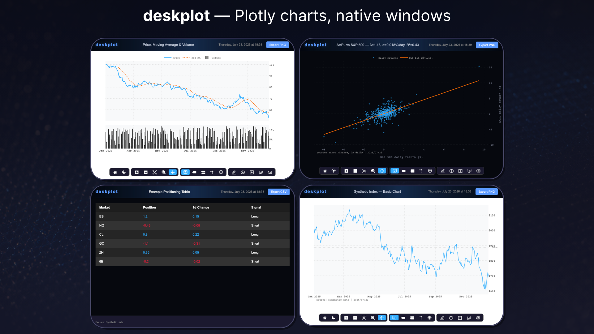
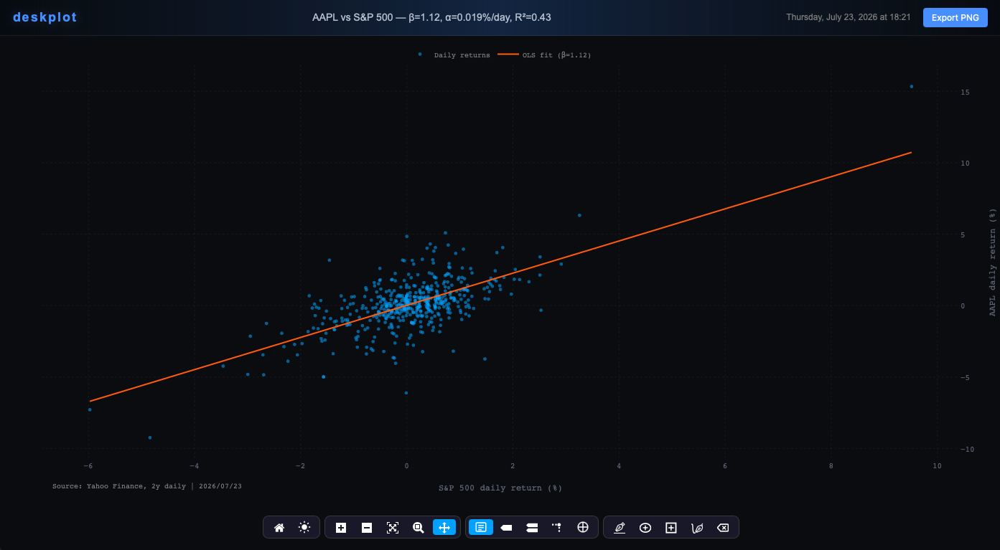

# deskplot — Plotly charts in native desktop windows

[](LICENSE)
[](https://www.python.org/downloads/)
[](https://github.com/astral-sh/ruff)
[](https://pypi.org/project/deskplot/)
[](https://github.com/chrisgalerakis/deskplot/actions/workflows/ci.yml)

**deskplot** is a Python library that displays [Plotly](https://plotly.com/python/) charts in **native desktop windows** instead of browser tabs. Every chart opens in its own non-blocking OS window with a terminal-style dark theme, a custom toolbar, a dark/light theme toggle, crosshair cursor, and one-click PNG export — all from a single `fig.show()` call.

If you have ever searched for *"how to show a Plotly chart in a window without a browser"*, *"Plotly desktop app"*, *"Plotly native window Python"*, or *"Plotly dark theme terminal charts"* — this is that library.

```python
import deskplot

fig = deskplot.ChartFigure()
fig.add_scatter(x=[1, 2, 3, 4], y=[10, 4, 12, 8], name="Series A")
fig.set_title("My First deskplot Chart")
fig.show()   # opens a native desktop window — your script keeps running
```



*Four native windows from the bundled [examples](examples/): dark and light theme (toggled in-window), subplots, a regression scatter, and the interactive table viewer — each with the branded header bar, one-click export, and grouped toolbar.*

## Who is this for?

deskplot is for people who build models, not GUIs.

- **Quant researchers and analysts** who live in Python scripts and notebooks — run the model, call `fig.show()`, and the chart is on your screen in a real window, not buried in tab number forty-seven.
- **Anyone who publishes their research** — newsletter authors, independent strategists, desk-note writers. Brand the header bar once, click **Export PNG**, and every chart you share carries your name and looks like it came off a trading terminal.
- **Backtesters and tinkerers** who want ten charts open side by side — each window is its own process, so open as many as the model demands and keep coding while they stay up.
- **Model builders who outgrew `plt.show()`** — use deskplot as the display layer of your local research terminal. Swap matplotlib's static viewer for native windows you can resize, zoom, hover, and arrange across monitors: your model calls `fig.show()` for every chart it produces, all of them stay open and interactive, and the script never blocks waiting for a window to close.

If your workflow is *build → look → screenshot → share*, deskplot removes every step between "the DataFrame is ready" and "the chart is in your publication."

## Why deskplot?

Plotly's default `fig.show()` dumps your chart into a browser tab: no window management, no consistent styling, and your charts get lost between fifty other tabs. The alternatives are heavy — [Dash](https://dash.plotly.com/) means running a web server; Qt/Tkinter embedding means writing GUI boilerplate.

deskplot gives you a third option: **a real desktop chart viewer in one line of Python**.

- **Native windows, not browser tabs** — each chart opens in its own OS window via [pywebview](https://pywebview.flowrl.com/)
- **Non-blocking** — windows run in separate processes; your script, REPL, or Jupyter kernel keeps running, and you can open as many chart windows as you want
- **Terminal-style dark theme** — a finance-terminal look (dark background, monospace fonts, dotted grid) applied automatically to every figure
- **Dark/light theme toggle** — switch themes inside the open window; all axes restyle correctly, including multi-axis and subplot figures
- **Custom toolbar** — grouped, bottom-centered mode bar: zoom, pan, unified tooltip, spike lines, crosshair cursor, and drawing tools (trend lines, rectangles, freehand)
- **One-click PNG export** — exports the full window including the branded header bar (chart captured via `Plotly.toImage`, header composited with vendored [html2canvas](https://html2canvas.hertzen.com/))
- **Brandable header bar** — put your own name, colors, and attribution on every chart window with one `deskplot.configure()` call
- **Interactive DataFrame tables** — display any pandas DataFrame as a sortable dark-themed table with CSV export
- **Browser fallback** — no pywebview installed? Same HTML opens in your default browser. Nothing breaks.
- **Offline-safe** — Plotly.js and html2canvas are embedded into the generated HTML; no CDN calls at render time

## Installation

```bash
pip install deskplot            # browser-fallback mode (plotly + pandas only)
pip install "deskplot[native]"  # + pywebview for native desktop windows
pip install "deskplot[image]"   # + kaleido for save_image() static export
```

> **Note:** until the first PyPI release you can install straight from a local clone: `pip install /path/to/deskplot`

Python 3.10+. Works on macOS out of the box; on Windows pywebview uses the built-in WebView2 runtime; on Linux it needs GTK or Qt (see [pywebview's installation guide](https://pywebview.flowrl.com/guide/installation.html)).

## Quickstart

### A chart in a native window

```python
import deskplot

fig = deskplot.ChartFigure()
fig.add_scatter(x=dates, y=prices, name="SPX", line=dict(color="#00ACFF"))
fig.add_hline_with_label(y=5000, label="Resistance", line_color="#e4003a")
fig.set_title("S&P 500")
fig.add_source_annotation("My Data Vendor")
fig.show()
```

`ChartFigure` subclasses `plotly.graph_objects.Figure`, so **everything you already know about Plotly works unchanged** — every trace type, layout option, and subplot spec.

### Subplots and dual axes

```python
fig = deskplot.ChartFigure.create_subplots(
    rows=2, cols=1, shared_xaxes=True, row_heights=[0.7, 0.3],
    specs=[[{"secondary_y": True}], [{}]],
)
fig.add_scatter(x=x, y=price, name="Price", row=1, col=1)
fig.add_bar(x=x, y=volume, name="Volume", row=2, col=1)
fig.show(title="Price & Volume")
```

### Scatter regression: AAPL vs S&P 500

A beta regression of AAPL daily returns on the S&P 500, fetched with [yfinance](https://github.com/ranaroussi/yfinance) (synthetic fallback when offline):



```python
import numpy as np
import deskplot

# x = S&P 500 daily returns (%), y = AAPL daily returns (%)
beta, alpha = np.polyfit(x, y, 1)
r_squared = np.corrcoef(x, y)[0, 1] ** 2
line_x = np.linspace(x.min(), x.max(), 100)

fig = deskplot.ChartFigure()
fig.add_scatter(x=x, y=y, mode="markers", name="Daily returns",
                marker=dict(color="#00ACFF", size=5, opacity=0.55))
fig.add_scatter(x=line_x, y=alpha + beta * line_x, mode="lines",
                name=f"OLS fit (β={beta:.2f})", line=dict(color="#FF6B00", width=2))
fig.update_layout(xaxis_title="S&P 500 daily return (%)",
                  yaxis_title="AAPL daily return (%)")
fig.set_title(f"AAPL vs S&P 500 — β={beta:.2f}, α={alpha:.3f}%/day, R²={r_squared:.2f}")
fig.add_source_annotation("Yahoo Finance, 2y daily")
fig.show()
```

Full runnable version: [`examples/05_regression_aapl_spx.py`](examples/05_regression_aapl_spx.py).

### A pandas DataFrame as an interactive table

```python
import deskplot
import pandas as pd

df = pd.DataFrame({"Asset": ["ES", "NQ", "CL"], "Position": [1.2, -0.4, 0.8]})
deskplot.show_table(df, title="Positioning", source="Internal model")
```

Sortable columns, alternating row colors, negative numbers in red, positive in blue, and an Export CSV button.

### Brand it as your own

```python
import deskplot

deskplot.configure(
    brand="ACME RESEARCH",          # header bar text
    brand_secondary="MACRO DESK",   # optional second label
    color_primary="#00C853",        # brand accent color
    source="ACME Research",         # default source attribution
    export_prefix="acme_chart",     # exported file names
)
```

Every window now carries your identity — useful for research shops, newsletters, and anyone publishing screenshots of their charts.

## How it works

`fig.show()` renders the figure to a standalone HTML file (Plotly.js embedded, custom header and toolbar injected), then launches a small viewer script in a **subprocess** that displays it with pywebview. Because each window is its own process:

- your Python script continues immediately (non-blocking),
- windows survive after the script exits,
- multiple windows never interfere with each other or with your main process.

Without pywebview, the same HTML opens via `webbrowser` — identical rendering, just in a tab.

## Configuration reference

| Option | Default | Description |
|---|---|---|
| `brand` | `"deskplot"` | Primary text in the window header bar |
| `brand_secondary` | `""` | Secondary header text (hidden when empty) |
| `color_primary` | `"#5b9aff"` | Brand text + button accent color |
| `color_secondary` | `"#e0e0e0"` | Secondary brand text color |
| `color_accent` | `"#5b9aff"` | Drawing-tool accent (trend lines, shapes) |
| `source` | `""` | Default source attribution (hidden when empty) |
| `chart_title` | `"Interactive Chart"` | Fallback chart window title |
| `table_title` | `"Data Table"` | Fallback table window title |
| `export_prefix` | `"chart"` | Filename prefix for PNG/CSV exports |
| `window_title_format` | `"{brand} - {title}"` | Native window title format |
| `log_prefix` | `"[deskplot]"` | Prefix for console messages |
| `axis_tick_font_size` | `11` | Font size of x/y axis tick labels |
| `axis_title_font_size` | `12` | Font size of x/y axis titles |

Set options **before** creating figures — they are applied when a `ChartFigure` is constructed.

## deskplot vs. alternatives

| | deskplot | Plotly `fig.show()` | Dash | Qt/Tk embedding |
|---|---|---|---|---|
| Native desktop window | ✅ | ❌ browser tab | ❌ browser | ✅ |
| One-line usage | ✅ | ✅ | ❌ app + server | ❌ GUI boilerplate |
| Non-blocking / multi-window | ✅ | ✅ (tabs) | ❌ | depends |
| Styled dark theme out of the box | ✅ | ❌ | ❌ | ❌ |
| In-window theme toggle, crosshair, branded export | ✅ | ❌ | build it yourself | build it yourself |
| Extra runtime | pywebview (optional) | none | Flask server | Qt/Tk |

## Limitations

- The bundled theme is **dark-first**; the in-window toggle provides a light view, but there is no standalone light `.pltstyle.json` yet.
- Native windows require a desktop session — on headless servers use the browser fallback or `fig.to_html()`.
- On Linux, pywebview needs GTK or Qt system packages.
- Each window embeds Plotly.js (~5 MB HTML temp file) for offline safety.

## Credits & attribution

- Built on [Plotly.py](https://github.com/plotly/plotly.py) and [pywebview](https://github.com/r0x0r/pywebview).
- The `.pltstyle.json` theming format and the grouped-toolbar concept are inspired by [OpenBB Terminal](https://github.com/OpenBB-finance/OpenBB) (MIT).
- [html2canvas](https://html2canvas.hertzen.com/) 1.4.1 (MIT) is vendored for header-inclusive PNG export.

deskplot was extracted from an internal systematic-macro research toolchain, where it renders positioning models and backtest dashboards daily.

## License

[MIT](LICENSE)
